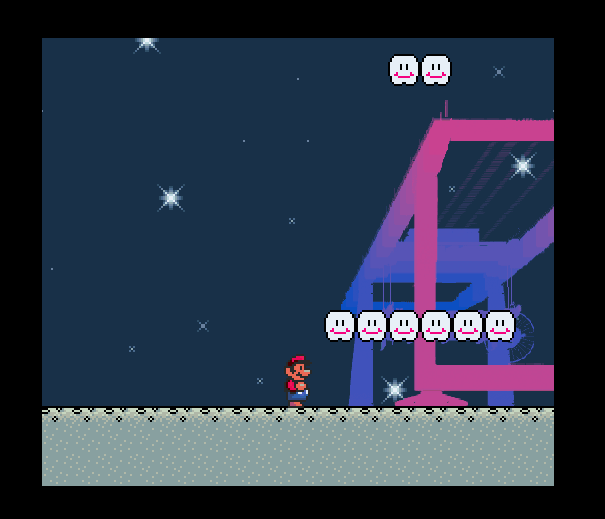
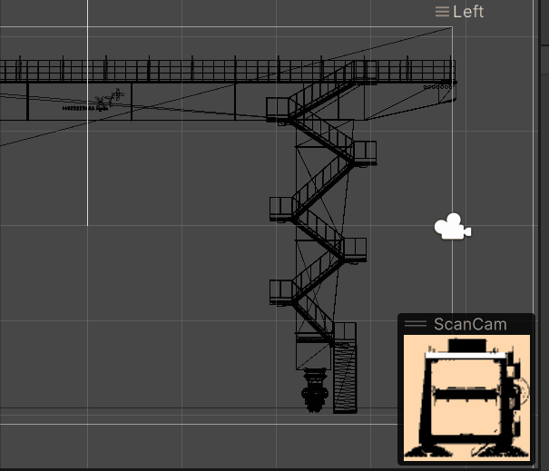
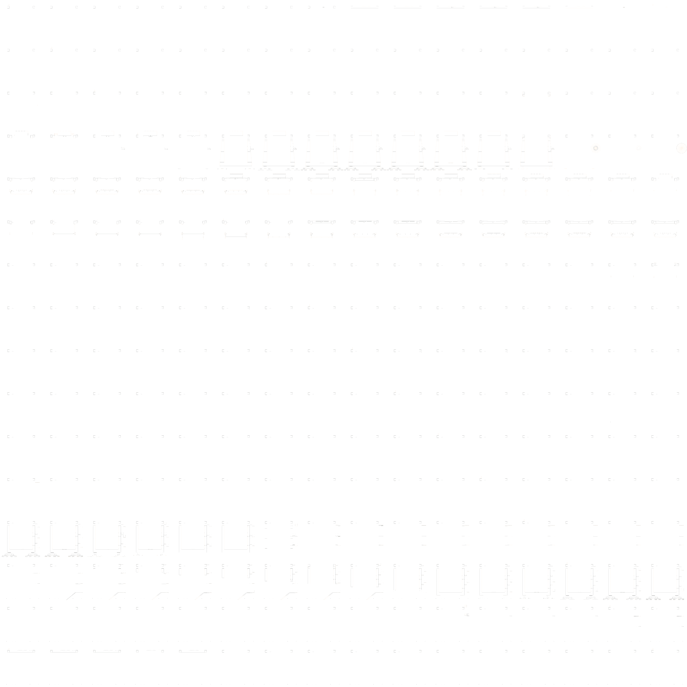
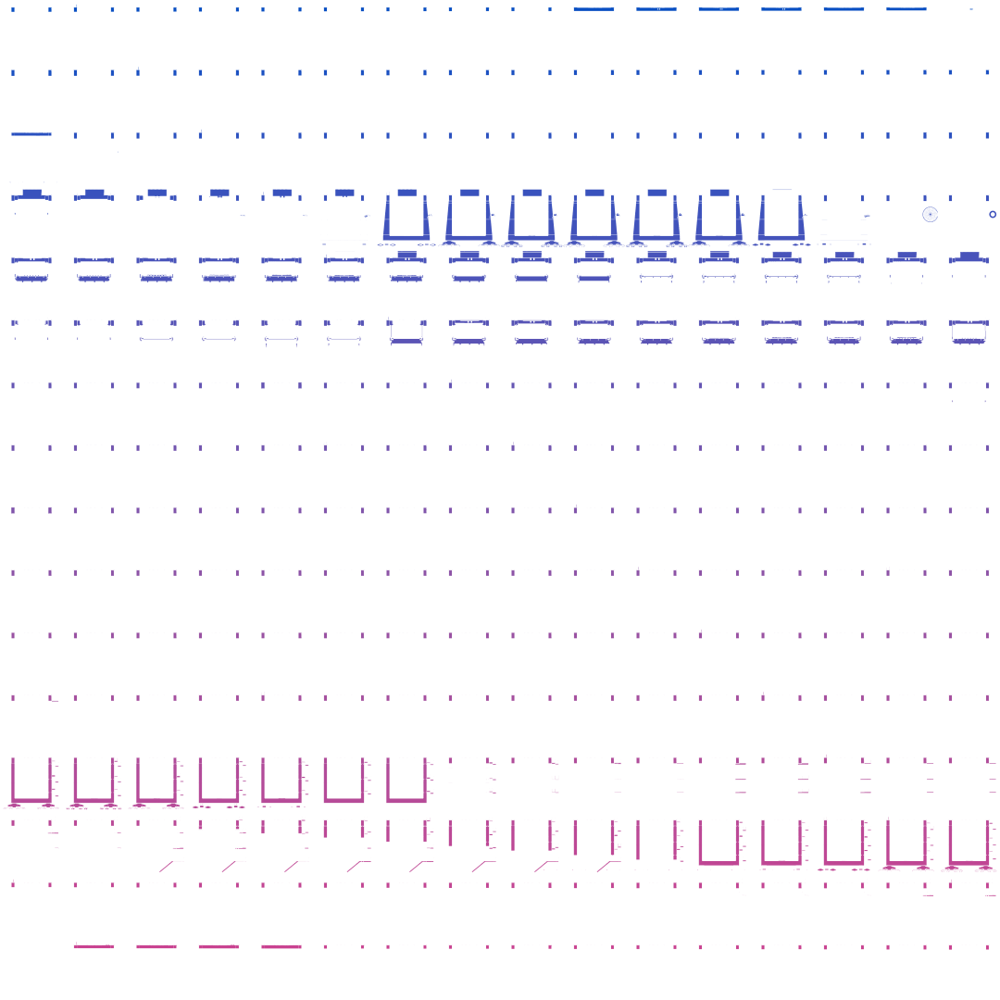
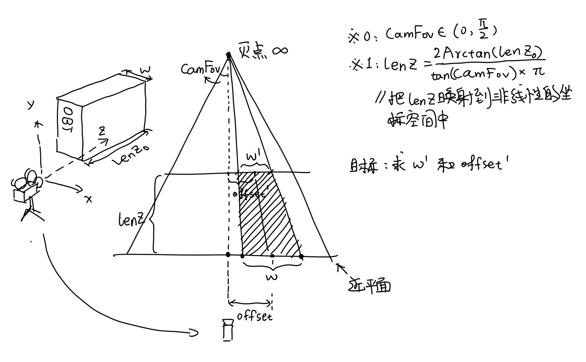

# SMBX 伪3D模型显示实验

#### 1. 前言

在 SMBX 38A 中，为了能够相对自由地加入并绘制素材，引擎为开发者提供了 Bitmap 这样的绘制工具。但是也许是出于简化接口的考虑，Bitmap 的设计思路与现代的图形绘制管线大相径庭，也使得其难以嵌入现代技术美术的工作流中。也是因为这样，在 SMBX 38A 中为了实现一个其它引擎中的常见效果通常需要寻找各种邪道……本文介绍一个在 SMBX 38A 中绘制 3D 模型的邪道方法🤔。

#### 2. 关于脚本的效果



#### 3. 前置准备

为了绘制出这样的效果，我们首先要准备一个网格模型（通常是一个 Fbx 或 Obj 格式的文件）。然后将其切片，并将生成的切片整齐排列到一张大的贴图中（以下称图集）（上面的效果演示用到的是一张 4094* 大小的图集）。然后在图像处理软件中对切片图集做后处理以达到目标效果。

##### 3.1. 对模型切片

模型切片的原理很朴素。在一般的即时渲染管线中，我们可以在像素着色器中获取到对应模型上每个像素的世界空间法线，只需要将法线和世界空间中的相机视线向量做点乘，当结果值大于 0 时像素着色器返回 `float4(0, 0, 0, 0)`，小于 0 时返回 `float4（1, 1, 1, 1）`。然后颜色合成阶段，设置合成方式为 `colDest * 1 + colSrc * 0` 。注意的是，不要开启管线的法线剔除，我们需要保留反向的面。再之后我们只需要设置好相机的远近平面就好了。

代码很短，在 HLSL 中只用一句：

```glsl
float4 pix(const pixel_data p) : SV_Target
{
    // camView 是当前相机在世界空间中的视线方向 - float3
    // p.normal 是当前像素在世界空间中的法线方向 - float3
    return dot(camView, p.normal) > 0 ? float4(0, 0, 0, 0) : float4(1, 1, 1, 1);
}
```

切片过程类似于：



上图中白色部分为截面，黑色和黄色部分的透明度为 0，在导出的贴图中是不可见的。

这里有一个用 Unity 引擎实现的[例程：https://gitee.com/xiaodouxd/model-clip-shader](https://gitee.com/xiaodouxd/model-clip-shader)。

切片导出合并的图集如下：



（有点像医院影像科里的磁共振刨面？？

##### 3.2. 图集后处理

后处理的部分比较自由，自行发挥就好，，

为了凸显前后的深度，我是用 PS 给图集加了个渐变。如果还有描边之类的需求，可以试试内阴影外阴影，感觉都挺不错的。如果你想给表面写一些纹理，也可以通过修改贴图完成。

处理后的图集如下：



至此，素材准备工作就完成了。后面是关于上述图集在 SMBX 38A 中的使用和一些简单的几何推导。

#### 4. SMBX 38A 中的计算与实现

因为一些偷懒，，实现中的名词使用并没有与管线中常用的 3D 投影模型同步，还有些地方用的经验模型😂，懒得做推导，我忏悔，，

本段做简单的式子介绍和实现介绍。在实现介绍的部分，依然尽可能保证性能和易用性，预留了一些实例池写法的接口。关于实例池可以在我过去的 2D 伪阴影脚本的介绍中找到一些小例。

##### 4.1. 计算

为了决定如何对图集的切片进行缩放，我们需要求解一些简单的式子。



在上图中，假定了模型最最近切片紧挨着近平面。且近平面与相机进行的是无滑动的相对运动。

易得
$$
Factor = (1 - lenZ\times \tan(camFov)) \\
\omega' = \omega \times Factor \\
offset' = offset \times Factor
$$
然后根据上述式子，我们从位于近平面的切片到位于 `ω'` 的切片进行线性插值（因为插值结果要是直线，所以只能是线性插值），即可得到每个切片的缩放和位移。

若要加上模型支持纵向移动的 PosZ，可以考虑在 Factor 项乘上 `1 - PosZ * tan(camFov)`，这里的 PosZ 同样是映射到非线性的坐标空间的 PosZ，虽然这样做不科学，，但是效果也凑合？

##### 4.2. 实现

根据上述的原理，在运行前，我们需要配置好如下参数：

（因为 SMBX 38A 的 Integer 类型有点毛病，实现中几乎全部用 Long 代之

```vbscript
' ================================= 参数设置
Dim clipWid As Long = 256           ' 切片宽
Dim clipHei As Long = 256           ' 切片高
Dim clipCountWid As Long = 16       ' 切片横向数量
Dim clipCountHei As Long = 16       ' 纵向切片数量

Dim clipAtlasId As Long = 256       ' 图集 id
Dim bitmapIdBegin As Long = 16      ' bitmap 起始 id

Dim posX As Long = -199456          ' 模型绘制位置 x (关卡坐标)
Dim posY As Long = -200440          ' 模型绘制位置 y (关卡坐标)
Dim posZ As Long = 0                ' 模型绘制位置 z (同时受到 lenZ 的限制)
Dim lenZ As Double = 1              ' 模型深度限制
Dim scale As Double = 1.4           ' 模型整体缩放

Dim zposBeg As Double = 0.9         ' 模型 bitmap zpos 起始
Dim zposStep As Double = 0.0001     ' 模型 bitmap zpos 步进

Dim camAsixX As Double = 0          ' 相机 x 向移轴
Dim camAsixY As Double = 140        ' 相机 y 方向移轴
Dim camFov As Double = 0.5          ' 相机视野
```

本脚本实例提供了四个接口：

```vbscript
' 创建模型所需的 Bitmap
Export Script CreateModelBitmap()

' 设置模型数据到对应的 Bitmap 上
Export Script SetData()

' 模型是否在屏幕中
' @return 在屏幕中返回 1 否则返回 0
Export Script InScreen(Return Integer)

' 显示并刷新模型
Export Script RefreshModel()

' 隐藏模型
Export Script HideModel()
```

在使用层只需要做如下运行就好：

```vbscript
Call CreateModelBitmap()
Call SetData()
Do
    If InScreen() = 1 Then
        Call RefreshModel()
    End If
	Call Sleep(1)
Loop
```

如果使用实例池进行 Bitmap 的管理，可以通过 InScreen 判断对应的 Bitmap 是否有被占用。若未被占用可分配给其他模型显示。若欲重新使用则调用 SetData 即可。

#### 5. 脚本小例下载地址

- 实例场景（包括模型）：示例场景下载地址

                                                               ---- 小豆 20230416